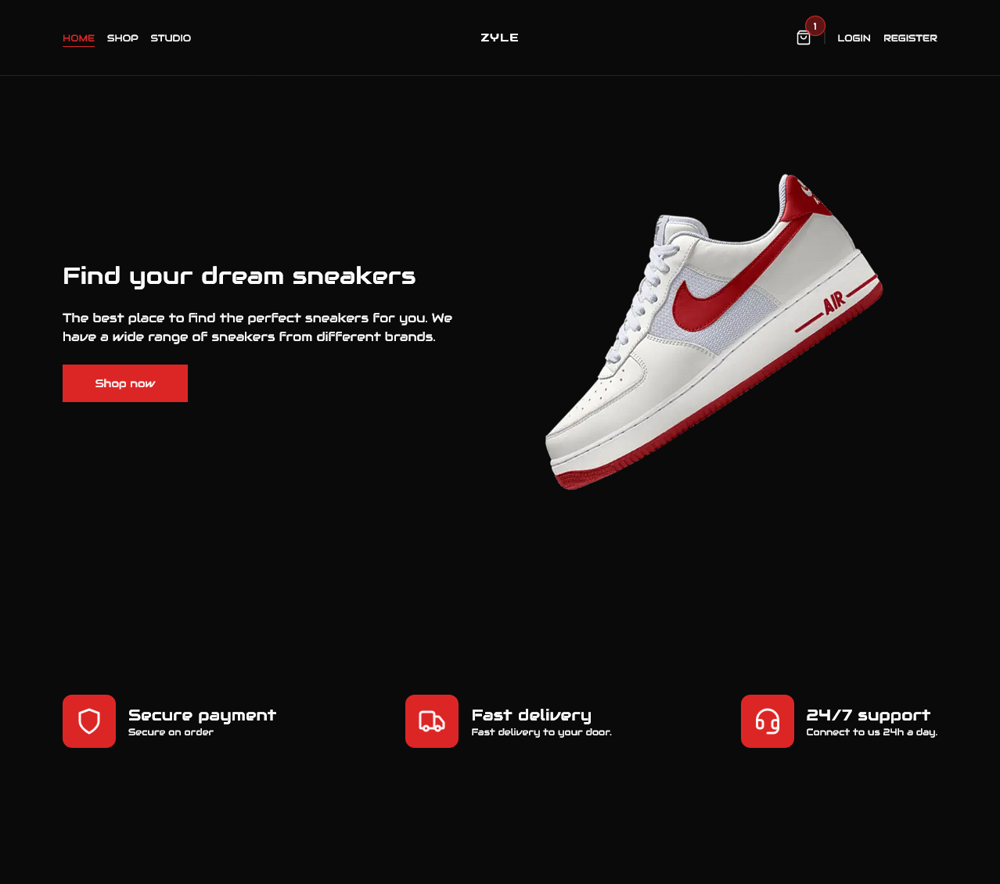
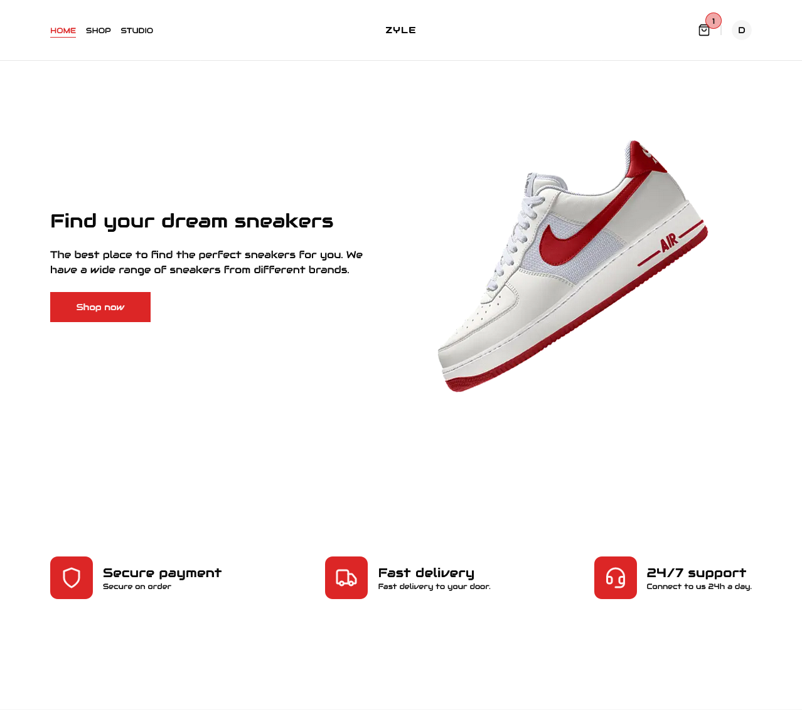
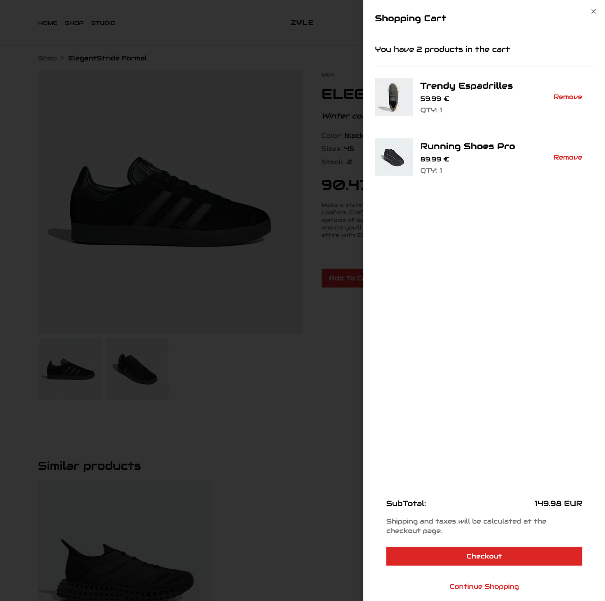
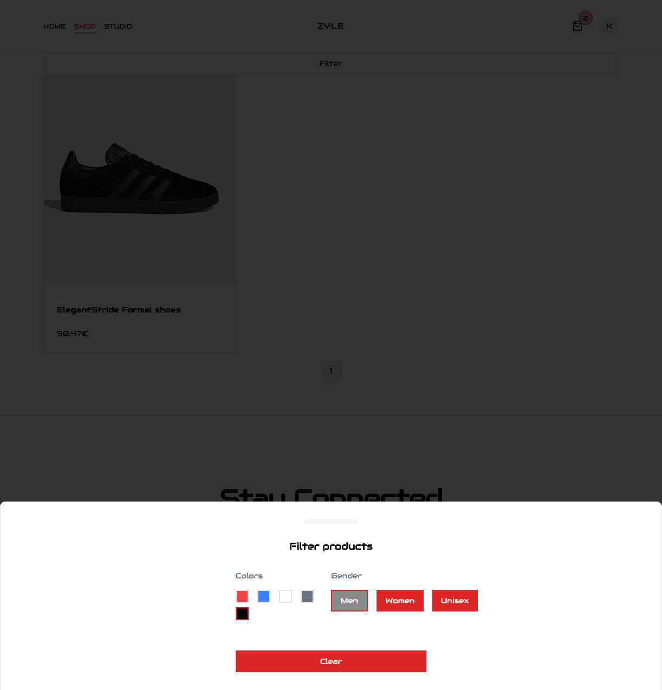
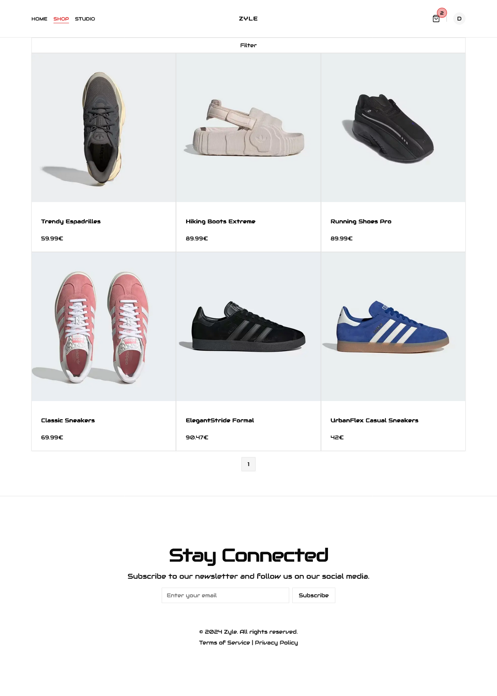
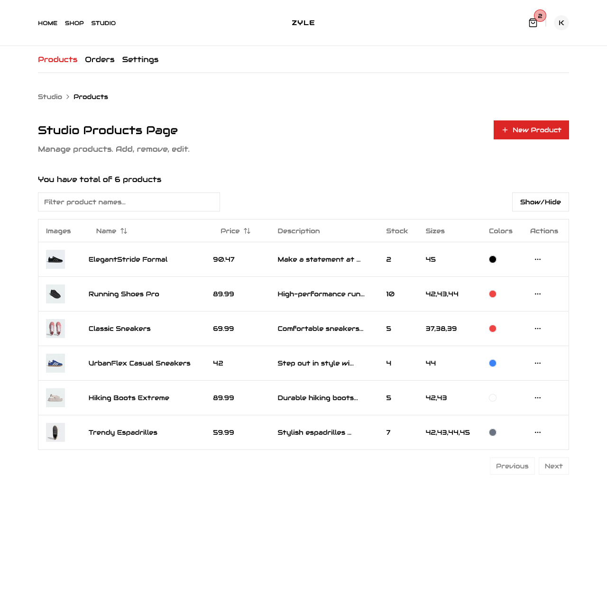

# Welcome to Zyle - Small E-Commerce

Zyle is dynamic, fast, and immersive e-commerce platform crafted with the latest technologies to redefine your online shopping journey

## 🚀 Tech Stack:

    Next.js 14.1.0: Powering Zyle with speed, efficiency, and the latest features of the Next.js framework.
    React 18: Elevating user interfaces and experiences with the latest React advancements.
    Supabase: Ensuring robust and secure data handling with Supabase JS and SSR for server-side rendering.
    Stripe Integration: Seamlessly integrated Stripe React and Stripe JS for secure and efficient payment processing.
    Tailwind CSS 3.3.0: Stylish and responsive designs using the latest Tailwind CSS features.
    Swiper 11.0.6: Elevating your product browsing experience with the dynamic Swiper carousel.
    Use Shopping Cart 3.2.0: Simplifying your shopping journey with a hassle-free and user-friendly cart management system.

## 💡 Innovative Features:

    Shadcn-ui UI Components: Elevating UI components like Accordion, AlertDialog, Avatar, Checkbox, Dialog, Dropdown Menu, Label, Select, Separator, Slot, and Switch for an engaging user experience.
    React Hook Form 7.50.1: Streamlining form management for smooth interactions.
    Locomotive Scroll 5.0.0-beta.11: Enhancing page scrolling with a smooth and engaging locomotive scroll.
    Zod 3.22.4: Ensuring data validation and integrity with the Zod schema.

## 🚧 Under the Hood:

    TypeScript 5: Bringing type safety and enhanced development workflows.
    Eslint 8 and Autoprefixer 10.0.1: Ensuring clean and standardized code for maintainability.
    PostCSS 8: Enhancing styles with modern CSS features.

## 🌟 What is Zyle

Zyle is an online e-commerce; it's fast, responsive and scalable. With studio integration dashboard for easy CRUD operations. Theme customization.

🚀 Getting Started with Zyle:

Setup supabase end for your database, where all the products and auth information will be stored.
Create a Supabase Account:

    Visit Supabase and sign up for an account.
    Create a new project and obtain your Service Key from the project settings.

Update .env File:

    SUPABASE_SERVICE_KEY=your_supabase_service_key
    SUPABASE_DATABASE_PASSWORD=your_supabase_database_password
    SUPABASE_ACCESS_TOKEN=your_supabase_access_token

Stripe Information:

    Head to the Stripe Dashboard and sign in or create an account.
    Obtain your Publishable Key (NEXT_PUBLIC_STRIPE_KEY) and Secret Key (STRIPE_SECRET_KEY).
    If you're using Stripe for webhooks, also get your Signing Secret (STRIPE_SIGNING_SECRET).

    NEXT_PUBLIC_STRIPE_KEY=pk_test_your_publishable_key
    STRIPE_SECRET_KEY=sk_test_your_secret_key
    STRIPE_SIGNING_SECRET=your_signing_secret

Install Dependencies:

    npm install

Run Zyle Locally:

    npm run dev

    Explore Zyle in Your Browser:
    Open your favorite browser and go to http://localhost:3000 to experience Zyle's cutting-edge features.

🌟 Enjoy

Some more images :)

Add to cart sidebar

Product filter

Shop page

Studio page

...And more in /demo folder
